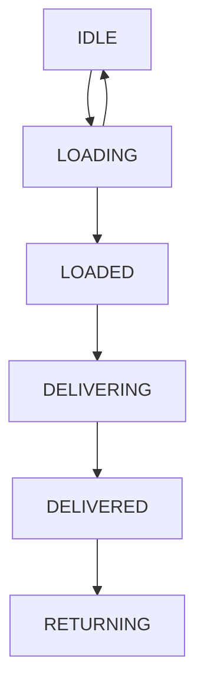

## Task "Delivering by drones"
**The project is not ready for review**
### Build
To build the service (create JAR) use following command:
```
./gradlew build
```
### Run
Command to run service:
```
java -jar build/libs/drontask-0.1.jar
```
DB H2 console available at 'http://localhost:8080/api/v1/h2-console'  
### Implementation Notes
#### REST API requests
to be written
#### Additional db table
to be written
#### Battery checker
to be written
### Dron :: Finite-state machine

### Next tasks in the project development (TODO)
- **exception handling** and understandable detailed messages when errors occur during entity validation ( maxweight > 600, battery > 100, ....);
- define logs dir relative to application jar path (not to the current dir);
- define BatteryChecker interval in app properties;
- create command **shutdown** service;
- handle **kill** service PID;
- jUnit tests;
