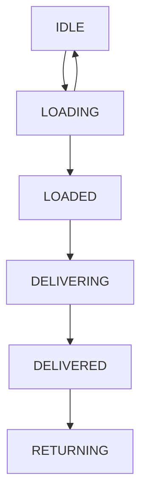

## Task "Delivering by drones"

### Build
To build the service (create JAR) use following command:
```
./gradlew build
```
### Run
Command to run service:
```
java -jar build/libs/drontask-0.1.jar
```
DB H2 console available at http://localhost:8080/api/v1/h2-console  
### Implementation Notes
#### REST API requests
##### Get a list of drones available for delivery parcel with a total weight:  &lt;weight-in-grams&gt;

Example

http://localhost:8080/api/v1/dron/available?weight=450

Result

```
[
{"id": 8,"imei": "SERIALNUMBER0008","model": "Heavyweight","maxweight": 500,"battery": 30,"state": "IDLE"}
. . .
,{"id": 8,"imei": "SERIALNUMBER0018","model": "Heavyweight","maxweight": 450,"battery": 80,"state": "IDLE"}
]
```
##### Register dron for loading

Example

http://localhost:8080/api/v1/dron/register/8

Result
```
OK
```
Errors

- "status": 409, "error": "Conflict", "message": "Invalid dron state"  (reason: drone already registered by another dispatcher) 
- "status": 409, "error": "Conflict", "message": "Dron low battery"   (reason: drone battery became under low limit)
- "status": 404, "error": "Not Found", "message": "Dron not Found"  (reason: drone has been deleted or not exist)

##### Unregister drone :: return state from LOADING to IDLE

Example

http://localhost:8080/api/v1/dron/unregister/8

Result
```
OK
```
Errors

- "status": 409, "error": "Conflict", "message": "Invalid dron state"  (reason: drone is not in LOADING state)
- "status": 404, "error": "Not Found", "message": "Dron not Found"  (reason: drone has been deleted or not exist)
 

#### Additional entities
We need to consider creating additional entities
- **Order** - date; drone selected for delivery; parcel id; dispatcher id; and others;
- **Parcel** - a list of elements and their quantities
#### Battery checker
Drone charge audits are performed every minute. Drones with a charge less than **${dron.battery.min}** (set in application.properties) are logged.
### Dron :: Finite-state machine

At the moment, only the transition of state from LOADING to IDLE (and back) is implemented. 
It is necessary to think over and provide for other transitions. 
It is also necessary to provide an additional task that will check if the drone stays in the LOADING state for more than a specified time interval.
### Next tasks in the project development (TODO)
- **exception handling** and understandable detailed messages when errors occur during entity validation ( maxweight > 600, battery > 100, ....);
- define logs dir relative to application jar path (not to the current dir);
- define **BatteryChecker** interval in app properties;
- create command **shutdown** service;
- handle **kill** service PID;
- jUnit tests;
